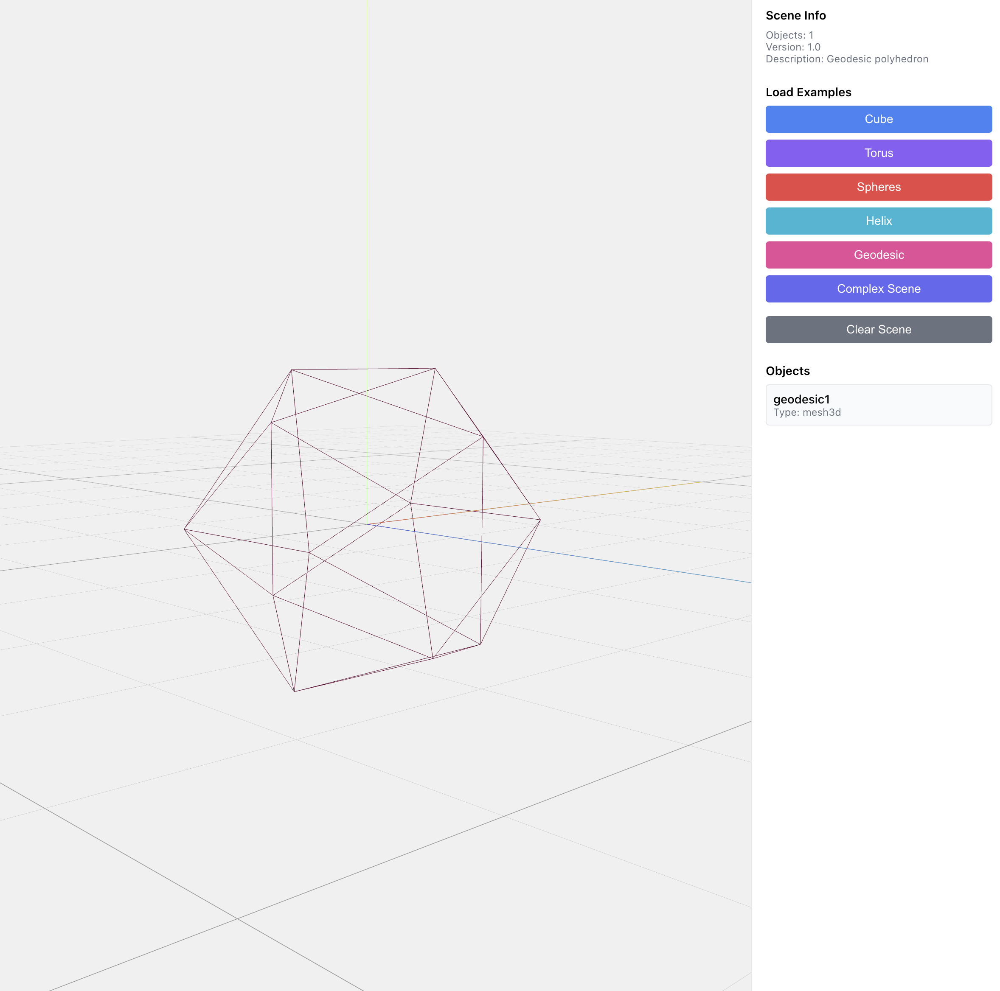

# geometry visualizer

professional 2d/3d geometry engine with interactive web visualization


*interactive 3d viewer with real-time rendering and procedural geometry generation*

## overview

a modern computational geometry library combining robust mathematical algorithms with interactive visualization. built for researchers, engineers, and developers who need precise geometric computation with visual feedback.

### why this matters

**computational geometry is everywhere**
- cad/cam systems and 3d modeling
- robotics path planning and motion control
- computer graphics and game engines
- geographic information systems (gis)
- computer vision and image processing
- scientific simulation and finite element analysis

**challenges with existing tools**
- matlab/mathematica: proprietary, expensive, no web visualization
- scipy: limited 3d primitives, no interactive viewer
- three.js alone: no computational geometry algorithms
- openscad: declarative only, limited programmatic control

**what we provide**
- **pure python core**: numpy/scipy-based, type-safe, tested
- **modern algorithms**: convex hull (monotone chain + graham scan), delaunay (bowyer-watson), voronoi diagrams, shapely-based boolean ops
- **immutable design**: functional programming paradigm for reliability
- **web visualization**: react + three.js with webgl acceleration
- **format support**: obj, stl, svg, json for cad/3d printing workflows

## features

**geometry core**
- primitives: points, vectors, polygons, meshes, planes
- transforms: translate, rotate, scale, shear (2d/3d affine)
- algorithms: convex hull, delaunay, voronoi, boolean ops
- i/o: obj, stl, svg, json
- numerical precision: configurable epsilon (1e-10 default)
- validation: robust geometric predicates (orient2d, in_circle)

**web viewer**
- real-time 3d rendering (three.js + webgl)
- interactive camera controls (orbit, pan, zoom)
- example shapes: cube, torus, spheres, helix, geodesic
- lighting: ambient, studio, custom presets
- export: screenshot, scene json

**architecture highlights**
- backend: python 3.11+, mypy type-checked, pytest coverage
- frontend: react 18, typescript strict mode, vite build
- data: json schema validation, versioned format
- extensible: plugin system for custom algorithms/exporters

## quick start

### install

```bash
# python library
cd backend && pip install -e .

# web viewer
cd frontend && npm install
```

### run

```bash
# start web viewer
cd frontend && npm run dev
# open http://localhost:3003

# or use python directly
python3
>>> from geometry_visualizer.primitives import Point2D
>>> from geometry_visualizer.algorithms.convex_hull import convex_hull_2d
>>> points = [Point2D(0, 0), Point2D(1, 0), Point2D(0.5, 1)]
>>> hull = convex_hull_2d(points)
>>> hull.area()
```

### demo

```bash
# run example
cd examples/convex_hull_demo && python3 demo.py
```

## usage

**compute convex hull**
```python
from geometry_visualizer.primitives import Point2D
from geometry_visualizer.algorithms.convex_hull import convex_hull_2d

points = [Point2D(x, y) for x, y in [(0,0), (1,0), (1,1), (0,1), (0.5,0.5)]]
hull = convex_hull_2d(points)
print(f"area: {hull.area()}, perimeter: {hull.perimeter()}")
```

**apply transformations**
```python
from geometry_visualizer.primitives import Point3D, Mesh3D
from geometry_visualizer.transforms import Transform3D

# rotate and scale mesh
transform = Transform3D.rotation_z(45) @ Transform3D.scaling(2, 2, 2)
transformed = mesh.transform(transform)
```

**create scenes**
```python
from geometry_visualizer.scene import Scene

scene = Scene()
scene.add_object("cube1", "mesh3d", cube, style={"color": "#3b82f6"})
scene.export_json("my_scene.json")
```

**triangulation**
```python
from geometry_visualizer.algorithms.delaunay import delaunay_triangulation

triangles = delaunay_triangulation(points)
```

## performance & implementation

**algorithm complexity**
- convex hull: O(n log n) - monotone chain or graham scan
- delaunay triangulation: O(n log n) - bowyer-watson with spatial indexing
- voronoi diagrams: O(n log n) - dual of delaunay
- polygon boolean ops: O((n+k) log n) - shapely/geos backend

**design principles**
- immutability: all primitives are frozen dataclasses
- type safety: full mypy coverage, no `Any` types
- numerical stability: configurable epsilon for float comparisons
- zero dependencies: core algorithms pure python + numpy
- tested: 26+ unit tests, pytest coverage

**comparison with alternatives**

| feature | geoviz | scipy | matplotlib | three.js |
|---------|--------|-------|------------|----------|
| convex hull | ✓ | ✓ | - | - |
| delaunay | ✓ | ✓ | - | - |
| voronoi | ✓ | ✓ | - | - |
| 3d transforms | ✓ | - | - | ✓ |
| web viewer | ✓ | - | - | ✓ |
| polygon boolean | ✓ | - | - | - |
| type hints | ✓ | partial | partial | ✓ (ts) |
| immutable | ✓ | - | - | - |

## structure

```
geoviz/
├── backend/              # python library
│   ├── geometry_visualizer/
│   │   ├── primitives.py
│   │   ├── transforms.py
│   │   ├── scene.py
│   │   ├── io.py
│   │   └── algorithms/
│   └── tests/
├── frontend/             # react + three.js
│   └── src/
│       ├── components/
│       ├── controllers/
│       └── types/
├── examples/
└── specs/
```

## development

```bash
# backend tests
cd backend && pytest tests/ -v

# frontend dev
cd frontend && npm run dev

# build production
cd frontend && npm run build
```

## requirements

**dependencies**
- python 3.11+ (backend)
- node.js 18+ (frontend)
- numpy 1.24+ (numerical arrays)
- scipy 1.10+ (spatial algorithms)
- shapely 2.0+ (robust boolean ops)

**optional**
- pytest (testing)
- mypy (type checking)
- ruff (linting)

## roadmap

- [ ] step-by-step algorithm visualization
- [ ] more 3d primitives (cone, cylinder, sphere)
- [ ] csg operations (union, difference, intersection)
- [ ] mesh simplification (quadric error metrics)
- [ ] point cloud processing
- [ ] bezier curves and nurbs
- [ ] physics simulation integration

## contributing

contributions welcome! areas of interest:
- algorithm optimizations
- new geometric primitives
- export formats (dxf, step, iges)
- gpu acceleration (webgpu, cuda)
- documentation and examples

## license

mit
