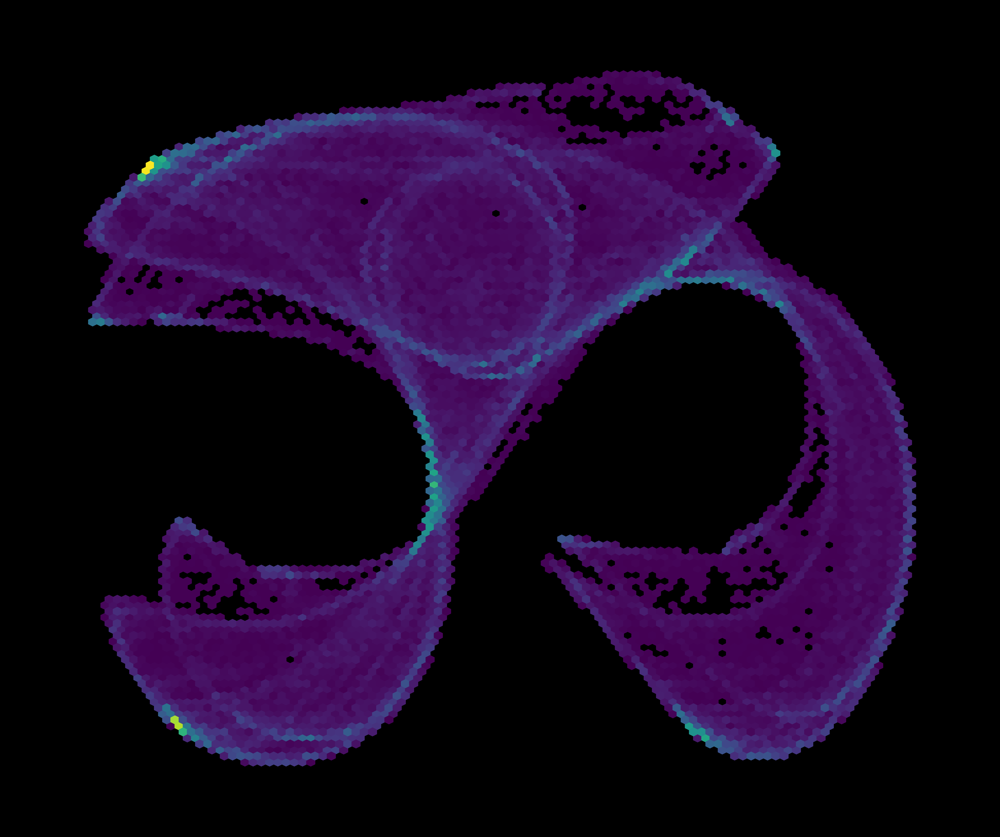

# math art generator

procedural art from mathematical equations





## install

```bash
pip install -e .
```

## quickstart

```python
from core.generators import LorenzAttractor
from core.renderers import StaticRenderer

attractor = LorenzAttractor(iterations=50000)
points = attractor.generate()

renderer = StaticRenderer(colormap="magma")
renderer.render(points, alpha=0.3)
renderer.save("output/art.png")
```

## examples

```bash
python examples/run_all_examples.py
open output/gallery.html
```

## license

mit

